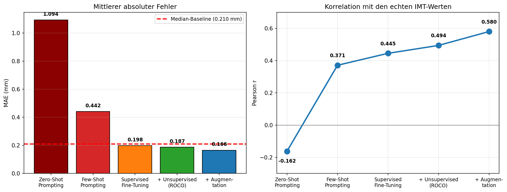

# Sono-Modalitätsexperte: Qwen2-VL Fine-Tuning für Ultraschall

Zweistufiges Fine-Tuning von Qwen2-VL-2B-Instruct:
1. **Unsupervised** auf 8.305 Ultraschall-Bild-Caption-Paaren (Modalitäts-Adaption)
2. **Supervised** auf 500 Carotis-Bildern (IMT-Schätzung)

## Datensätze

| Datensatz | Quelle | Bilder | Verwendung |
|---|---|---|---|
| ROCOv2 (Ultraschall) | HuggingFace `eltorio/ROCOv2-radiology` | 8.305 | Unsupervised (Bild-Caption) |
| CUBS | Mendeley (DOI: 10.17632/m7ndn58sv6.1) | 500 | Supervised (IMT in mm) |

Split (CUBS): 400 Training / 50 Validation / 50 Test

## Methode

- **Basismodell:** Qwen2-VL-2B-Instruct
- **Fine-Tuning:** LoRA (r=16, alpha=32), 0,20 % trainierbare Parameter
- **Augmentation:** Gain-Variation + Speckle-Rauschen (keine Rotation oder Verzerrung, da sie die IMT verfälscht)

## Ergebnisse

**Phase 1 (unsupervised):** Perplexity 18.64 → **8.46** (−55 %)

**Phase 2 (supervised, IMT):**

| Ansatz | MAE (mm) | vs. Baseline | Pearson r |
|---|---|---|---|
| Zero-Shot Prompting | 1.094 | −425 % | −0.162 |
| Few-Shot Prompting | 0.442 | −110 % | 0.371 |
| Supervised Fine-Tuning | 0.198 | +5.8 % | 0.445 |
| + Unsupervised Vortraining | 0.187 | +11.2 % | 0.494 |
| **+ Augmentation (final)** | **0.166** | **+19.5 %** | **0.580** |

Median-Baseline: 0.210 mm

**Bootstrap (n=50, 10k Resamples):** Pearson r = 0.580, 95%-KI [0.402, 0.732] → signifikant.
ΔMAE vs. Baseline: 95%-KI [−0.001, +0.084] → knapp nicht signifikant.

## Modelle

| Ordner | Beschreibung |
|---|---|
| `model/unsupervised_adapter/` | Nach Phase 1 (Modalitätsexperte) |
| `model/final_adapter/` | Phase 2 ohne Augmentation |
| `model/final_adapter_augmented/` | **Finales Modell** |

Jeder Ordner enthält `metrics.json` mit den zugehörigen Kennzahlen.

## Reproduktion

Notebook `notebooks/ultraschall_carotid.ipynb` bietet zwei Wege:

- **Komplette Reproduktion:** Alle Zellen ausführen (~2 h). Datensätze und Basismodell
  werden automatisch geladen.
- **Fertiges Modell testen:** Nur die Zellen *"Modell laden"* + *"Evaluation"* ausführen (~5 min).

## Limitationen

- Testmenge n=50 → begrenzte statistische Aussagekraft
- Regression zur Mitte: Vorhersage-Streuung nur 72 % der echten Streuung → niedriger Recall (53 %)
- Ein VLM schätzt, es misst nicht geometrisch

## Quellen 
### Wissenschaftliche Datensätze & Publikationen
*   **[ROCOv2](https://doi.org/10.48550/arXiv.2405.10004)** (Radiology Objects in COntext Version 2)  
*   **[CUBS](https://doi.org/10.1016/j.compbiomed.2022.105333)** (Carotid Ultrasound Boundary Study)  
